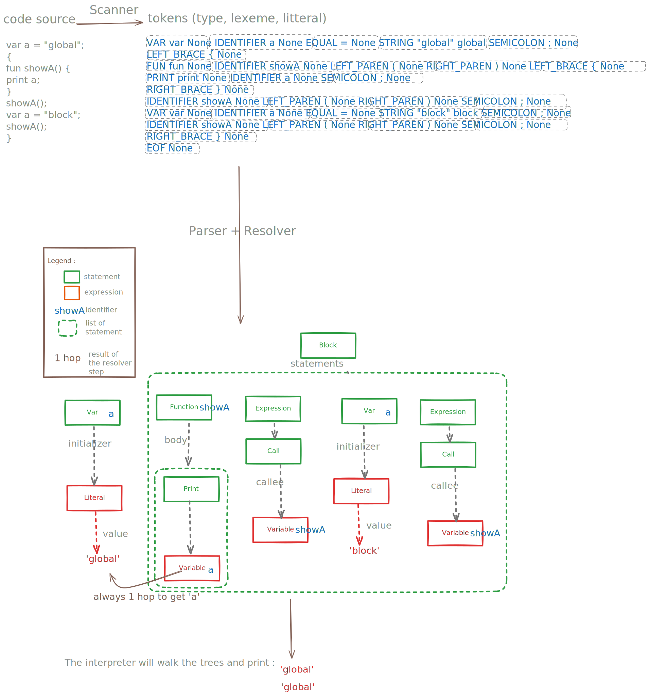

Tree-Walk Interpreter implemented in python from craftinginterpreters.com

-- --
 ### Usage 
 ```bash
    python3 plox.py  # for REPL
    python3 plox.py <source code>
 ```

 -- --

From the source code to the execution there is 4 steps : Scanning, Parsing, Resolver, Interpreter .

A big image to explain each step :

